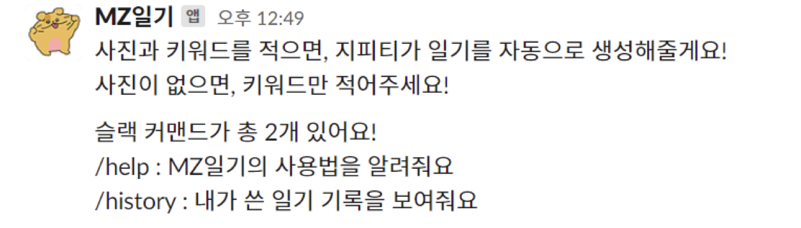
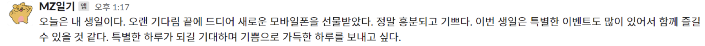
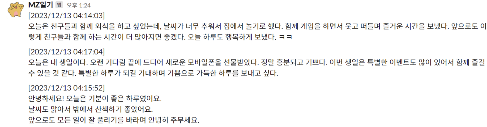
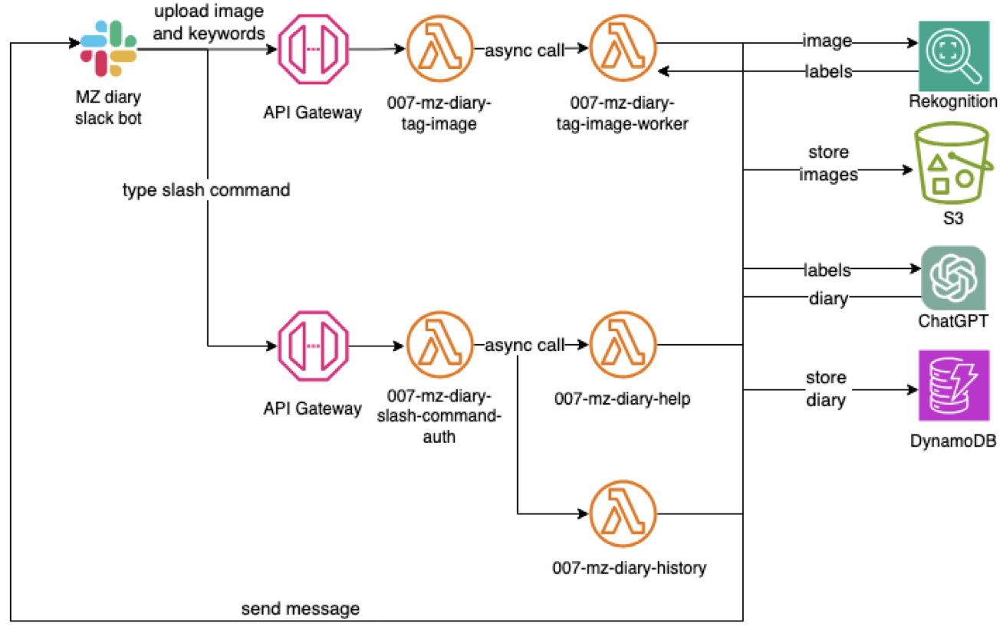

# MZ-Diary
사진과 키워드로 ChatGPT가 일기를 자동으로 생성해주는 슬랙 봇

## 기능 소개
### 1. /help 입력

### 2. 일기 작성

### 3. 일기 조회

## 클라우드 아키텍처

## 담당
- 강현 : 클라우드 및 슬랙 봇 구축, 슬랙 봇 사용법 소개 기능 개발
- 김경태 : 일기 생성 및 조회, 키워드 추출 기능 개발
- 이성민 : 프로젝트 문서화, 발표

## 데모 영상
https://github.com/Inha-HighTech/MZ-Diary/assets/62539341/3f6722af-dc1b-4376-aad2-7fe5fbb35b2b

